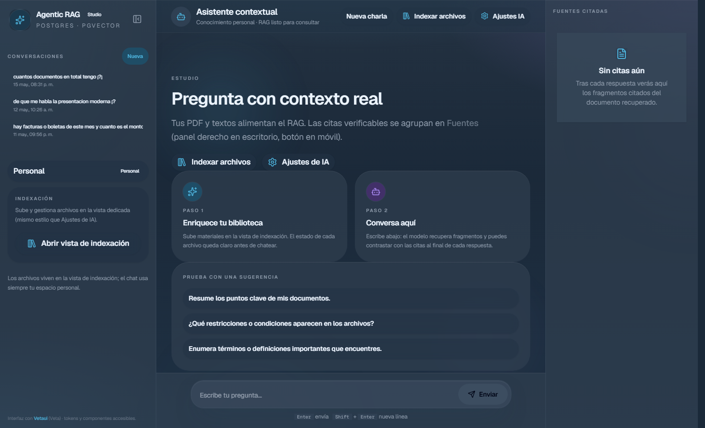
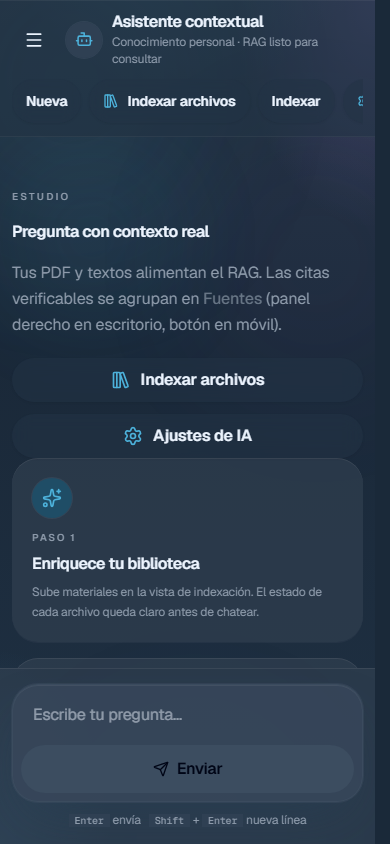
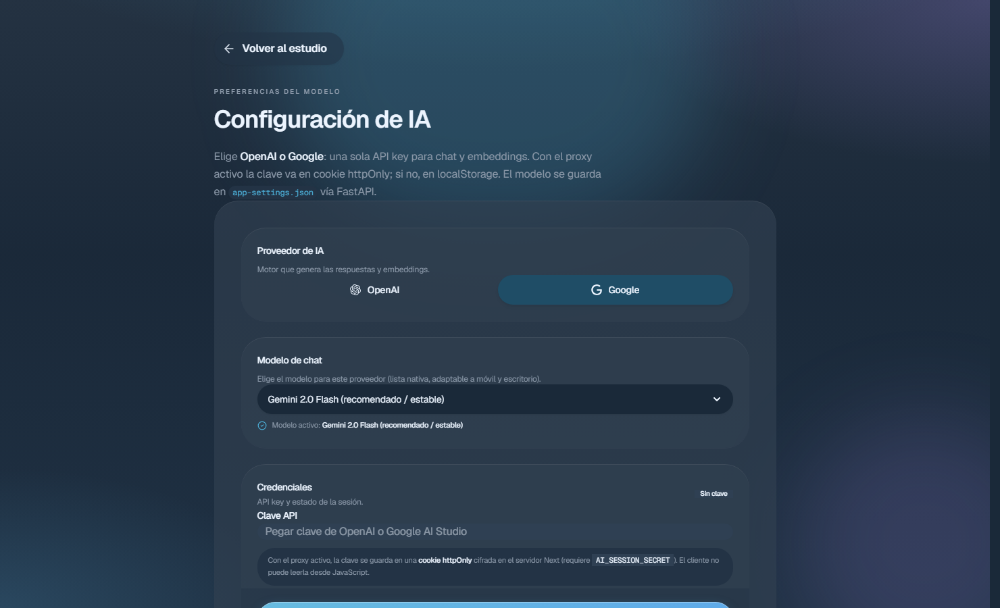

# RAG Knowledge Base Agent

Monorepo según [PLAN.md](./PLAN.md): **Next.js** (solo UI) + **FastAPI** (backend `/api/...`) + **PostgreSQL** con **pgvector**, chat RAG con citas.

## Interfaz (capturas)

La web (`apps/web`) usa **[Vetaui](https://www.npmjs.com/org/vetaui)** —paquetes npm `@vetaui/foundations`, `@vetaui/atoms`, `@vetaui/molecules`, `@vetaui/organisms` y `@vetaui/templates`— encima del sistema de diseño **Veta** (tokens semánticos OKLCH, presets de marca y componentes accesibles). La capa visual del producto ajusta radios, fondos y acentos en `apps/web/src/styles/agentic-premium.css`.

Vistas principales: chat con biblioteca lateral, variante en pantalla estrecha y pantalla de ajustes de IA.

### Escritorio: chat y biblioteca

Tres columnas (biblioteca · transcripción · fuentes citadas en `lg+`): conversaciones, base de conocimiento, acceso a indexación; panel central del asistente con compositor tipo consola.



### Móvil: área de chat

En viewport reducido la biblioteca es un cajón (menú arriba a la izquierda); las citas se abren con **Fuentes**. Captura del estado inicial con sugerencias.



### Configuración de IA (`/settings`)

Proveedor (OpenAI o Google), modelo y credenciales; mismo marco de página que indexación (`AgenticAppPageShell`). Enlace desde **Ajustes IA** en la cabecera del chat.



Las capturas del repo se generan con Playwright (`scripts/capture-readme-screenshots.ps1`) esperando el atributo `data-readme-ready` en el HTML servido. Deben tomarse contra la **web del contenedor Docker** (imagen de producción), no contra `npm run dev`. Con el stack en marcha, desde la raíz del repo:

```powershell
.\scripts\capture-readme-screenshots.ps1
```

El script usa `http://127.0.0.1:<puerto>` donde `<puerto>` es `WEB_PUBLISH_PORT` o `3000`. Si Next en desarrollo ocupa el 3000, levanta solo la web publicada en otro puerto (ver Opción A) y ejecuta el script con el mismo puerto en el entorno.

## Requisitos

- **Solo Docker**: Docker Desktop (o Docker Engine + Compose v2).
- **Desarrollo híbrido** (Postgres en Docker, apps en el host): Node.js 20+, Python 3.12+ y Docker.

---

## Opción A — Todo en Docker (recomendado)

En la **raíz** del repositorio.

### 1. Levantar Postgres, Redis, API, worker y web

```powershell
docker compose up -d --build
```

- **Postgres** (pgvector): puerto `5432`.
- **Redis**: cola interna para indexación.
- **API** (FastAPI / Uvicorn): [http://localhost:8000](http://localhost:8000) — salud: [http://localhost:8000/api/health](http://localhost:8000/api/health).
- **Worker**: consume la cola Redis y ejecuta la indexación.
- **Web** (Next.js producción): por defecto [http://localhost:3000](http://localhost:3000) (mapeo `${WEB_PUBLISH_PORT:-3000}:3000` en `docker-compose.yml`).  
  Con proxy activo el navegador usa rutas `/api/rag-proxy/...` hacia el mismo host y puerto; el servidor Next reenvía al contenedor `api`.  
  Si el **3000** del host está ocupado (p. ej. `npm run dev`), antes de `docker compose up` define `$env:WEB_PUBLISH_PORT = "3001"` y entra por `http://localhost:3001`. La API admite CORS en localhost **3000** y **3001** sin configuración extra.

Los **subidos** y `storage/app-settings.json` persisten en el volumen `rag_web_storage`, montado en **`/app/storage`** tanto en `web` como en `api` (misma carpeta lógica).

### 2. Primera vez: migraciones y seed

Ejecútalos **después** del paso 1 (con `db` en marcha):

```powershell
docker compose --profile tools run --rm migrate
docker compose --profile tools run --rm seed
```

`seed` crea el usuario `dev@local.rag` y la base de conocimiento **Personal**. Si omites `migrate`, la app fallará al consultar tablas que aún no existen (p. ej. error 500: `relation "knowledge_bases" does not exist`).

**Desde la raíz del repo** también puedes usar: `npm run db:migrate`, `npm run db:seed` o `npm run db:setup` (equivalente a los dos comandos de arriba).

### 3. IA (claves y proxy)

En Docker Compose la web se construye con **`NEXT_PUBLIC_USE_RAG_PROXY=true`**: el navegador llama a **Next** (`/api/rag-proxy/...`) y la API key se guarda con **cookie httpOnly** cifrada (variable **`AI_SESSION_SECRET`** en el servicio `web`, ya definida de ejemplo en `docker-compose.yml`; cámbiala en producción).

En [http://localhost:3000/settings](http://localhost:3000/settings): proveedor, modelo y API key. La clave no queda en `localStorage`.

**Sin proxy (desarrollo híbrido):** en `apps/web/.env` pon `NEXT_PUBLIC_USE_RAG_PROXY=false` y las claves pueden seguir en `localStorage` como antes.

**Solo servidor:** en el API puedes definir `OPENAI_API_KEY` o `GOOGLE_API_KEY` en el entorno; el backend las usa si no llega `X-API-Key`.

### Indexación en cola (Redis + worker)

Los servicios **`redis`** y **`worker`** encolan la indexación de documentos. Si Redis no está disponible, la API sigue indexando con **BackgroundTasks** como antes.

### Comandos útiles

| Comando | Descripción |
|--------|-------------|
| `docker compose up -d` | Arranca `db`, `redis`, `api`, `worker` y `web` |
| `docker compose logs -f api` | Logs del backend FastAPI |
| `docker compose logs -f web` | Logs del front Next.js |
| `docker compose logs -f worker` | Logs del worker de indexación (Redis) |
| `docker compose down` | Para contenedores (los volúmenes de datos se conservan) |

---

## Opción B — Next + FastAPI en local, solo Postgres en Docker

### 1. Base de datos

```powershell
docker compose up -d db
```

### 2. Variables (`apps/web`)

```powershell
cd apps\web
copy .env.example .env
```

En `.env`: `DATABASE_URL` con **localhost**; **`NEXT_PUBLIC_API_URL=http://127.0.0.1:8000`**; **`API_INTERNAL_URL=http://127.0.0.1:8000`** (para el proxy de Next). Para cookie segura de IA: `NEXT_PUBLIC_USE_RAG_PROXY=true` y **`AI_SESSION_SECRET`** (mín. 16 caracteres). Si usas solo `localStorage`, deja `NEXT_PUBLIC_USE_RAG_PROXY=false`.

### 3. API Python (`apps/api`)

```powershell
cd apps\api
python -m venv .venv
.\.venv\Scripts\pip install -r requirements.txt
copy .env.example .env
```

Ajusta `STORAGE_ROOT` en `apps/api/.env` para que coincida con la carpeta `storage` de Next (por defecto en el ejemplo: `../web/storage` si trabajas con `cwd` en `apps/api`). `DATABASE_URL` debe usar **localhost**.

Arranque del API:

```powershell
.\.venv\Scripts\uvicorn app.main:app --reload --host 127.0.0.1 --port 8000
```

### 4. Migraciones y seed (desde `apps/web`)

```powershell
npm run db:migrate
npm run db:seed
```

### 5. Next en desarrollo

```powershell
npm run dev
```

Abre [http://localhost:3000](http://localhost:3000). Salud del API: [http://127.0.0.1:8000/api/health](http://127.0.0.1:8000/api/health).

---

## Scripts útiles (`apps/web`)

| Script | Descripción |
|--------|-------------|
| `npm run dev` | Next.js en desarrollo |
| `npm run build` | Build (también usado por la imagen Docker) |
| `npm run db:migrate` | Migraciones Drizzle |
| `npm run db:seed` | Usuario + KB de desarrollo |
| `npm run db:studio` | Drizzle Studio |

---

## Estado del código (resumen)

- Esquema Drizzle (en `apps/web`): `users`, `knowledge_bases`, `documents`, `chunks` (vectores **768** + índice HNSW), etc. Las migraciones siguen ejecutándose con `npm run db:migrate` en la imagen/herramienta `migrate`.
- **FastAPI** (`apps/api`): indexación (PDF / TXT / MD), embeddings, chat RAG, listados, ajustes persistidos en `storage/app-settings.json`.
- **Chat** (`POST /api/chat` en el API): embedding de la pregunta → búsqueda → respuesta según proveedor en ajustes.
- **Ajustes**: claves en localStorage; modelos en `storage/app-settings.json` (compartido con el volumen Docker `rag_web_storage`).
- **Next.js (UI)**: interfaz con **Vetaui** (`@vetaui/*`) y capa de producto en `apps/web/src/styles/agentic-premium.css`.

## Estructura

```
RAG-Documents/
├── PLAN.md
├── docker-compose.yml
├── README.md
└── apps/
    ├── api/               # FastAPI + Dockerfile
    └── web/               # Next.js + Dockerfile
```
